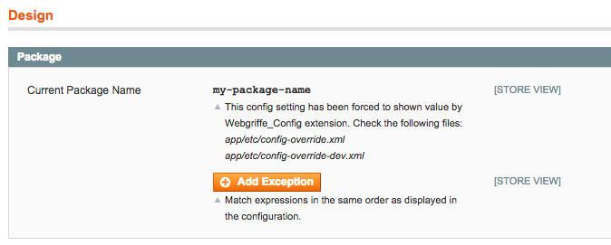

Webgriffe Config
================

[](https://travis-ci.org/webgriffe/config-extension)

Magento 1.x extension that improves config system.

Indeed, Magento configuration is driven by database. This, sometimes, is overkill and forces us to maintain upgrade scripts to keep Magento envorinment aligned with features development.

Installation
------------

To use the version greater or equal than `3.*` of this extension you need to have the Magento core itself managed by [Composer](https://getcomposer.org/) using the Aydin Hassan's [magento-core-composer-installer](https://github.com/AydinHassan/magento-core-composer-installer) and a `magento-core` package like the [Bragento's](https://github.com/bragento/magento-core) `magento/core`.

Indeed the version greater or equal than `3.*` of this extension uses the Cameron Eagans's [composer-patches](https://github.com/cweagans/composer-patches) to apply a patch to the `Mage_Core_Model_Config` to allow configuration override.

If not already installed, add to your project the [Magento Composer Installer](https://github.com/magento-hackathon/magento-composer-installer), and then add the `webgriffe/config-extension` and the `cweagans/composer-patches` packages to your dependencies:

	composer require --no-update webgriffe/config-extension
	composer require --no-update cweagans/composer-patches

Then you need to add an `extra` configuration to your `composer.json` file with the patch configuration:

```json
"extra": {
    "patches": {
        "magento/core": {
            "Config model patch to allow override": "https://raw.githubusercontent.com/webgriffe/config-extension/master/config-model.patch"
        }
    },
    "composer-exit-on-patch-failure": true
}
```
If you have a different package as Magento core you have to use its name in the `patches` section.

Moreover you have to remove the `magento/core` package from the filesystem so the package is re-installed and then patched.

	rm -rf vendor/magento/core
	
Finally, you can install the extension:

	composer update webgriffe/config-extension cweagans/composer-patches
	
Composer should output something like the following during the installation:

	- Applying patches for magento/core
    vendor/webgriffe/config-extension/config-model.patch (Config model patch to allow override)
	- MagentoCoreInstaller: Installing: "magento/core" version: "1.9.3.7" to: "magento"

Now you should have the extension succesfully installed and the `Mage_Core_Model_Config` patched, look at the `app/code/core/Mage/Core/Model/Config.php` to confirm that it's patched (you should see a patch comment on the class heading).

If you cannot manage the Magento core with Composer you have to use the version `2.*` of this extension but you'll miss the latest features and the installation steps are different and are described on the `README.md` of the `2.x` branch.

Config override
---------------

So, this extension enables additional config file that overrides database configuration. The file must be at path `app/etc/config-override.xml.dist`. For example:

```xml
<?xml version="1.0"?>
<config>
	<default>
    	<general>
        	<locale>
            	<code>en_US</code>
            </locale>
	    </general>
    </default>
    <stores>
    	<it_it>	    			
			<general>
        		<locale>
    	        	<code>it_IT</code>
	            </locale>
    	    </general>
    	</it_it>
    </stores>
</config>
```
	
The extension tries also to load the *non-dist* file at `app/etc/config-override.xml` which, if present, extends the `app/etc/config-override.xml.dist`. In this way you can put the `app/etc/config-override.xml.dist` file under version control to share that configuration with others but ignore the `app/etc/config-override.xml` to have it only on your machine.
	
Environment specific config
---------------------------

You can set different config based on current environment by defining several environment config files that must be placed in `app/etc` and must be named with the pattern `config-override-{env}.xml.dist` where `{env}` is the current environment (for example `config-override-dev.xml` for `dev` environment or `config-override-prod.xml.dist` for `prod` environment). Environment specific config ovverrides `app/etc/config-override.xml.dist` config explained above. To specify the current environment you must set the environment variable `MAGE_ENVIRONMENT`. For example in Apache virtual host configuration or in the `.htaccess`file you can do:

	SetEnv MAGE_ENVIRONMENT "dev"
	
Even with environment specific configuration you can use *dist* and *non-dist* files. So you can have `config-override-dev.xml.dist` which can be extended by `config-override-dev.xml`.
	

EcomDev_PHPUnit local.xml.phpunit laoding
-----------------------------------------

This extension also allows to load the `local.xml.phpunit` file of the [EcomDev_PHPUnit](https://github.com/EcomDev/EcomDev_PHPUnit) testing module. To enable this feature the `MAGE_LOAD_ECOMDEV_PHPUNIT_CONFIG` environment variable must be set to `1`.
Then using a library like [CgiHttpKernel](https://github.com/igorw/CgiHttpKernel) you can do full acceptance (or functional testing) on a test-dedicated database (which is also used by other EcomDev_PHPUnit's tests). Have a look at [Webgriffe's Functional Test Trait](https://github.com/webgriffe/functional-test-trait) for more information.

Overridden config values are shown in backend
---------------------------------------------

Overridden config values are shown in Magento's backend. Every config setting it's shown on its section. For example, if you have the following `config-override.xml` file:

```xml
<?xml version="1.0"?>
<config>
	<default>
    	<design>
        	<package>
            	<name>my-package-name</name>
          </package>
	    </design>
    </default>
</config>
```	

When you'll go to `System -> Configuration -> General -> Design` you'll find the overridden config value shown and not editable.



This feature improves a lot the usability of this extension.

To Do
-----

* Performance improvements
* Interdependent fields handling
* Password/encrypted fields handling


